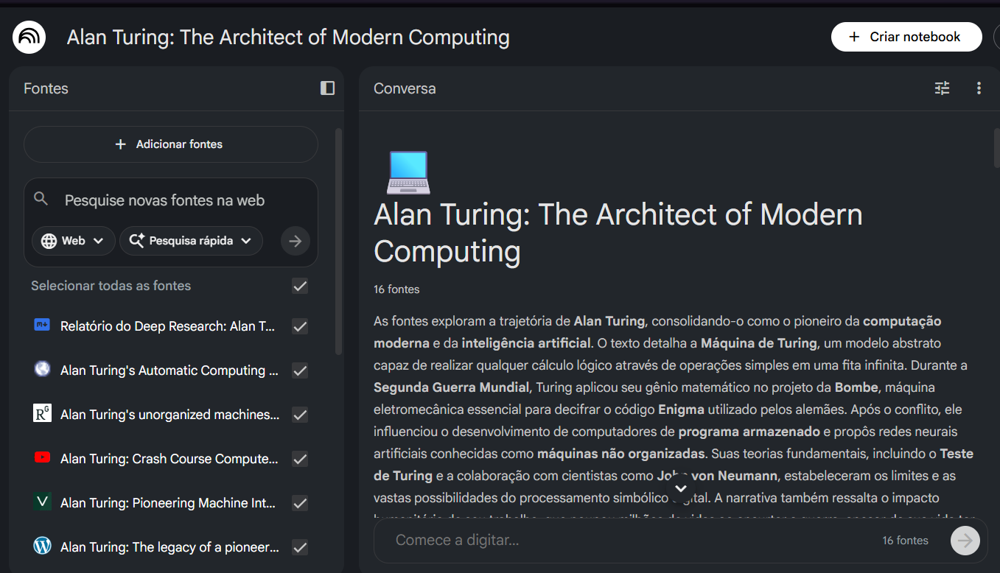
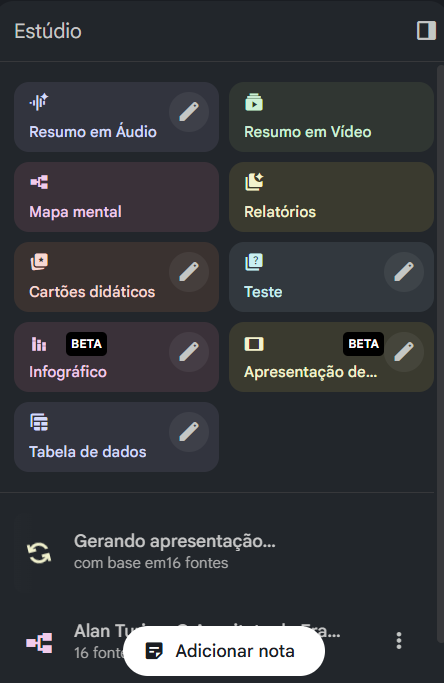
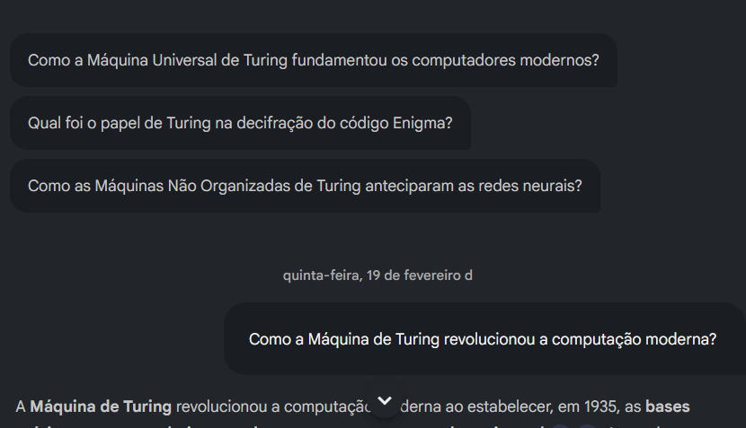
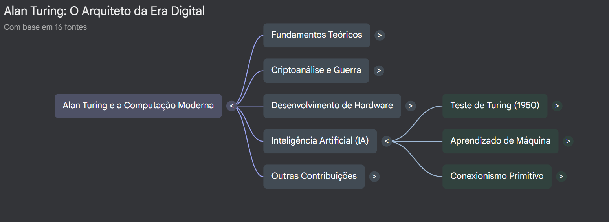
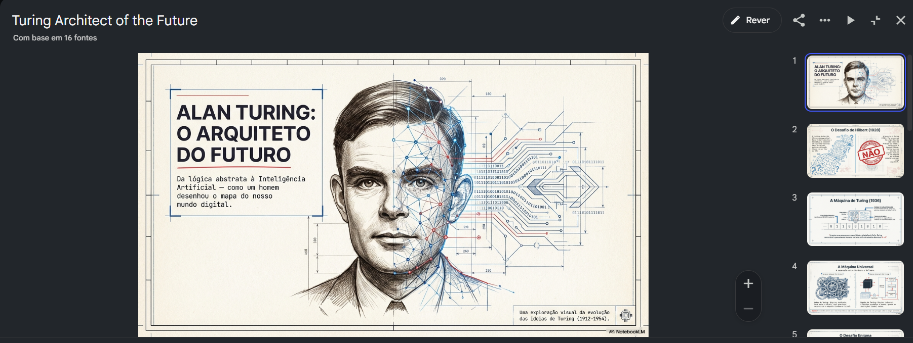

# Explorando o NotebookLM

## Introdução

    

    NotebookLM da google é uma ferramenta que tem por objetivo ser um assistente de pesquisa e escrita, integrado a Inteligência Artificial Gemini (VILLARINHO, 2024).
    

    

    A plataforma permite o usuário criar "cadernos" personalizados, por meio de uploads de documentos, links de vídeos e sites, e artigos. Após realizar todos os uploads, a IA construirá um resumo e perguntas somente com base nos materiais fornecidos. Além disso, ele pode construir apresentação de slide, resumo em vídeo, mapa mental, e muitas outras opções (VILLARINHO, 2024).
    

## Projeto Teste

O desafio propõe desenvolver um pequeno projeto no NotebookLM para o aluno compreender o poder dessa ferramenta e de como ela pode ajudar no aprendizado de um determinado assunto, evitando a possibilidade da IA sofrer alucinação devido a quantidade extensa de sites, vídeos e artigos disponíveis da Web.

### Meu mini-projeto

    <strong>Ideia principal:</strong> Fazer com que a IA atue como um segundo cérebro baseado nos ensinamentos de Alan Turing e de como foram importantes para o surgimento da computação moderna e inteligência artificial.

#### Fontes e output da IA (com base as fontes)

<ul>
    <li>
        Na esquerda apresenta todas as fontes selecionadas que a IA poderá ler. Acima há uma barra de pesquisa que é possível pedir para IA pesquisar fontes de um determinado assunto. 
    </li>
    <li>
        Na direita apresenta a saída. Um resumo baseado nas fontes apresentadas para a IA. Ela somente leva em consideração as fontes presentes no "caderno".
    </li>
</ul>

Essa é seção que permite construir apresentação em slide, vídeos e etc, com base nas fontes selecionadas.

Perguntas criadas pela própria IA que caso selecionadas retornam um texto respondendo a pergunta.

Esse é o mapa mental que a IA construiu com base as fontes.

Esse é a apresentação de slide feita pela IA com base as fontes.

## Referências bibliográficas

VILLARINHO, Juliana. NotebookLM: tudo sobre IA do Google que analisa textos e cria podcast. Techtudo, 08 out 2024. Disponível em: <a href="https://www.techtudo.com.br/guia/2024/10/google-notebooklm-tudo-sobre-ia-que-analisa-textos-e-cria-podcast-edsoftwares.ghtml">link do site</a>. Acesso em: 20 fev 2026

